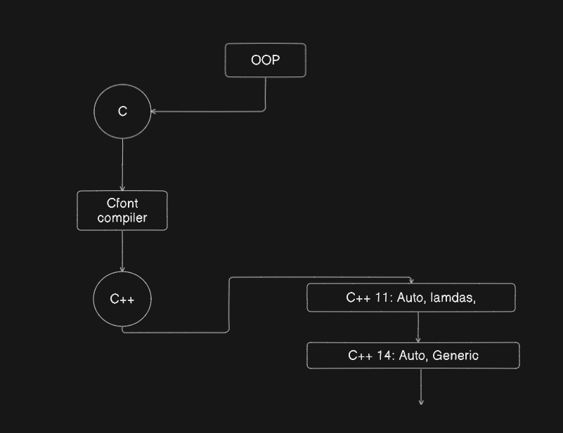

# C-Repo

## 1. Main features of C++ are : -

    > Its Platform independent
    > Object oriented
    > Statically-typed
    > Speed
    > Pointers for memory management

## 2. How C++ is designed by Bjarne stroustrup:

> He first add OOP in C and then useing a compiler called Cfont group up both oop and c and compile it as C++. First version of C++ is 11, further it will be modified and release many version upto 23 or more.

## 3. Namespace in C++ :

- Namespace in c++ is like a region where we can decide what method should be run.
- There are many namespace available like std. Some of then are: Qt framework, Eigen, gtest, etc.
- We can load whole namespace like : `using namespace std;` Here namespace is std
- Load a specific method from a namespace : `using std::cout;`

## 4. Data manipualtion in C++ :

- In any programming language there are three step to oparate. These are like `Store` data, `Process` data and also `Display` the data to the user. In Store we can study about datatypes and constant with help of which we can store the data. In Process we can study about loops, oop, functions, etc. And in Display we can study about how the data will be display to the user.

## Data types in C++ :

- Primitive type : The basic unit of data which is store in memory is called primitive data type, like int, char, float, boolean, void, etc but not array. primitive data types are the basic types of data built into the language.They serve as the fundamental building blocks for data manipulation in programs
- Derived type : Its a enhance version of primitive data type. some of them are like array, pointers, reference, function, etc.
- User defined : user-defined data types (UDTs) are types that programmers define themselves to extend the functionality of the built-in and derived data types. These types allow developers to group various pieces of data together and model real-world objects more effectively. Some of them are structure, union, enum, class, typedef.

## Signed and unsigned integer :

- signed integer accept all positive and negative value for store and in unsigned integer accept only positive value. If we try to store or assign negative number then it will return some garbage number so need to worry in this case because in c++ we can assign any value to any data type, as a result it can return some garbage value which is not efficient programming so we need to avoid it because c++ cannot throw error in this case.
